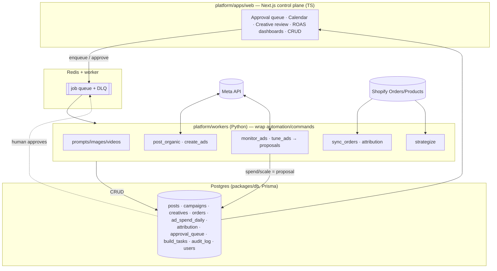
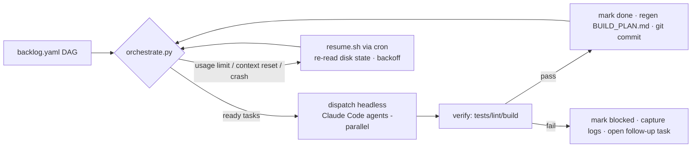

# More Green — Autonomous Marketing Platform (v0 → SaaS): Master Plan

> This is the **index**. Detailed, self-contained specs live in `./moregreen/`:
> | # | Doc | Covers |
> |---|---|---|
> | 01 | [`moregreen/01-data-model.md`](./moregreen/01-data-model.md) | Every table/entity, columns, relationships, indexes, **full CRUD matrix**, migrations, seed-from-SQLite |
> | 02 | [`moregreen/02-build-engine.md`](./moregreen/02-build-engine.md) | Self-continuing orchestrator, backlog DAG, cron/resume, state machine, locking, **happy + unhappy flows** |
> | 03 | [`moregreen/03-profit-attribution.md`](./moregreen/03-profit-attribution.md) | Shopify order ingest, ad-spend ingest, blended-ROAS attribution, CRUD + failure paths |
> | 04 | [`moregreen/04-approval-and-spend.md`](./moregreen/04-approval-and-spend.md) | Approval-queue lifecycle, propose/approve/reject/apply, money-safety invariants, edge cases |
> | 05 | [`moregreen/05-web-platform.md`](./moregreen/05-web-platform.md) | Next.js control plane, REST/Server-Action CRUD per resource, screens, auth, error states |
> | 06 | [`moregreen/06-strategist-content-creative.md`](./moregreen/06-strategist-content-creative.md) | Strategist brain, calendar autopilot, creative studio, storefront/product-page loop |
> | 07 | [`moregreen/07-flows.md`](./moregreen/07-flows.md) | End-to-end **happy + unhappy flow catalog** (sequence-level), retries, compensation |
> | 08 | [`moregreen/08-backlog.md`](./moregreen/08-backlog.md) | Full epic → story → issue → task DAG, dependencies, acceptance, verify commands |
> | 09 | [`moregreen/09-verification.md`](./moregreen/09-verification.md) | Test matrix, verification steps, CI, sandbox fallbacks |

---

## Context

**What exists today (audit result).** `automation/` is a genuinely working Python pipeline — not scaffolding. A Click CLI (`main.py`) drives ~25 commands with *real* integrations: Anthropic (captions/prompts), fal.ai FLUX+Kling (image/video), Cloudinary (hosting), Meta Graph/Marketing API (organic posting + ads create/monitor/tune), Google Sheets (calendar), Shopify (customer→audience sync), SendGrid, YouTube; plus a Streamlit founder dashboard with prompt/creative approval gates. State is SQLite (`posts`, `ad_campaigns`, `insights_cache`, `influencers`, `influencer_conversations`, `hashtag_usage`). Reusable infra: `utils/db.py` (`get_db`), `utils/guards.py` (`@require_approval`), `utils/retry.py` (`checked_post`), `utils/secrets.py`, `utils/notifications.py` (`notify_founder`), `utils/meta_auth.py` (`validate_meta_token`).

**Gaps blocking "run it like a profit-maximizing marketing head":**
1. **No profit/ROAS truth** — ROAS is only Meta's self-reported `omni_purchase`; no Shopify order/revenue ingestion → no blended ROAS, no SKU-level return, no attribution.
2. **No strategist/orchestration** — humans press buttons; nothing decides what to make, which creative to scale, how to reallocate budget.
3. **No money-safety queue** — `tune_ads --apply` mutates budgets directly.
4. **No storefront loop** — Shopify is hardcoded URLs + audience sync only.
5. **Single-user local stack.**

**Decisions locked (from clarifying Q&A):** **propose-then-approve** on any spend · **re-architect to SaaS** · optimize **blended ROAS**.

**Honest scope.** A multi-tenant SaaS rivaling billion-dollar platforms is a multi-week program. The centerpiece of this run is therefore a **self-continuing Build Engine** (living plan → epics → stories → issues → tasks; orchestrator dispatches granular tasks to parallel Claude Code agents; checkpoints to disk + git after every task; **resumes via cron when usage limits or the context window are hit**). This run also ships the **first working vertical** of the new platform (Postgres + Next.js control plane + ROAS attribution + approval-gated spend), reusing the existing Python integrations as worker jobs (we do **not** rewrite Meta/fal/Claude logic in TS).

---

## Target architecture

The Build Engine survives context/usage exhaustion because **all state is on disk** (`backlog.yaml` + git); each task is atomic + idempotent, so a fresh process continues from the next `todo` whose deps are `done`.

---

## Scope of THIS run vs. autonomous continuation

**This run (implemented + verified by me, then PR):**
- **E0** Build Engine & cron — complete.
- **E1** Platform foundation (Postgres/Prisma schema + migrations + seed, Next.js skeleton + 4 screens with CRUD, worker bridge) — complete.
- **E2** Profit loop (sync_orders, ad_spend ingest, attribution, blended-ROAS dashboard) — started/functional in dry-run.
- **E3** Approval-gated spend (queue + tune_ads→proposals + apply_approved) — started/functional.
- **E4** Strategist first cut — proposal-only.

**Autonomous continuation (Build Engine works the rest of `backlog.yaml`, resumed by cron):** remainder of E2–E4 plus **E5** creative studio, **E6** calendar autopilot, **E7** storefront/product-page loop, **E8** channels, **E9** SaaS hardening (auth, multi-tenant, RBAC, secrets vault, observability, CI).

---

## Money-safety invariants (enforced + tested everywhere)

1. No code path **activates** or **increases** ad budget without an `approval_queue` row in `approved` state.
2. **Pausing / stopping** spend (waste protection) remains automatic and immediate.
3. Hard caps (`MAX_DAILY_SPEND_INR`, `MAX_CAMPAIGN_BUDGET_INR`) are checked before any apply; breach → reject + alert.
4. The orchestrator commits only its own task artifacts; never force-pushes, never touches `.env`/secrets, never deletes user data.
5. Every state-changing action writes an `audit_log` row (who/what/when/before→after).

Full detail and the CRUD/flow specifics are in the linked docs. Implementation order, file-by-file, is in [`08-backlog.md`](./moregreen/08-backlog.md); verification in [`09-verification.md`](./moregreen/09-verification.md).
